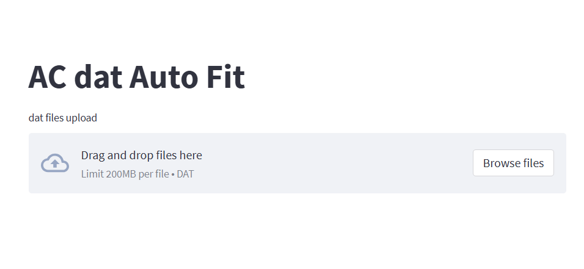
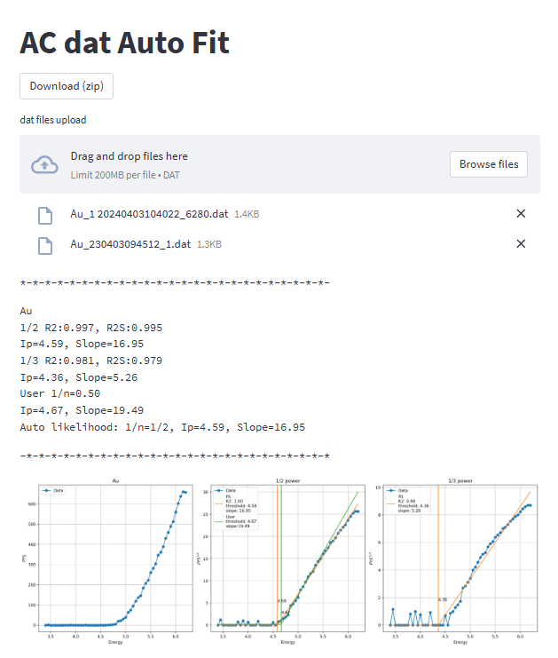
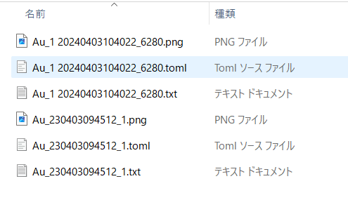

# ACdat-AutoFit

20250526　改訂版（Version2）

理研計器ACシリーズで測定したdatファイルをアップロードすると、自動で閾値を推定するお試し版（非公式）のWebアプリです。
（あくまでもお試しですので、利用者の責任で利用し、閾値の最終判断をしてください。）

https://acdat-autofit-huy3ftxmaqjr4ivninr3rh.streamlit.app/

測定結果の1/2乗、1/3乗を計算して、拡張されたReLU関数 [1]をFitting関数として、最小化関数として絶対誤差を用いて推定を行っています。

それぞれのべき乗に対してFittingの当てはまり（決定係数：R2）を評価し、決定係数が1に近い方を推奨としています。

R2が全体の決定係数、R2Sが閾値よりエネルギーが高い領域のみで計算した決定係数です。バックグラウンド成分に大きなノイズが乗っているときはR2Sの方の指標を優先した方がよいかもしれません。

なお、datファイルフォーマットの仕様および変換については理研計器社にお問い合わせください。

理研計器社が配布している変換ツール

- AC-2、AC-3：（MDB型）変換ソフトで.datフォーマット（新形式0） へ変換
- AC-5：.datフォーマット（旧形式） 変換ソフトで.datフォーマット（新形式）へ変換

賛同いただけたらこちらの論文をリファレンスに入れて頂けるとありがたいです。

- [1] Shinjiro Yagyu , Michiko Yoshitake, Takahiro Nagata; Automatic Analysis Method for the Threshold and Power Exponent of Spectra Interpreted by the Power Law.
Journal of Surface Analysis. 30 [2] (2023) 98-112 10.1384/jsa.30.98 
https://doi.org/10.1384/jsa.30.98

- [2] Shinjiro Yagyu; Program for Extracting Metadata from Measurement files of the Photoelectron Yield Spectrometer in Air (AC series by RIKEN KEIKI Co., Ltd.)
Journal of Surface Analysis. 29 [2] (2022) 97-110 10.1384/jsa.29.97
https://doi.org/10.1384/jsa.29.97

---

Datファイルをドラッグアンドドロップしてください。（複数のファイルも可能）

GithubリポジトリにあるtestDataの中のファイルをテストとして利用することができます。

----

PYSの強度を1/2、1/3乗したグラフぞれぞれにReLU関数でのFittingを行います。そして決定係数を求めて比較します。

比較の結果、１つ目のデータは1/2乗の方が当てはまりがよいので、1/2乗で解析した閾値が選ばれています。なお、1/2乗のUserの線は人が引いた線です。

Download(zip) ボタンを押すとグラフと解析結果のレポートのダウンロードができます。
- グラフイメージ　png形式
- 解析結果　Text形式
- 解析結果　Toml形式（Text editorで開くことができます。）※Tomlは、Key, valueで記述された形式。
- 複数アップロードの解析結果のまとめ　CSV形式

---

Version0からの変更内容
- 複数ファイルを同時アップロードへ変更
- 傾き情報を表示
- 解析情報も含めてダウンロードできるように変更
- 参照しているモジュールの内容を見直し

Version1からの変更内容
- pfiltlib、readerモジュールをアップデート
- ACdataのカウント最大値の制限(AC-2, AC-3 Max :2000cps, AC-5, AC-2S Max :4000cps)
- エネルギー最大値の制限（6.8eV以下で解析）

